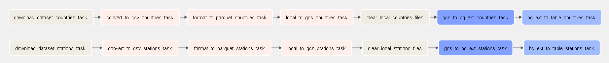
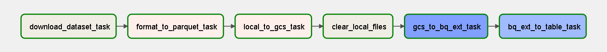
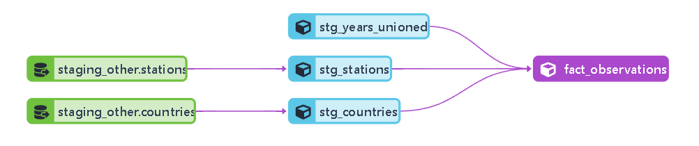
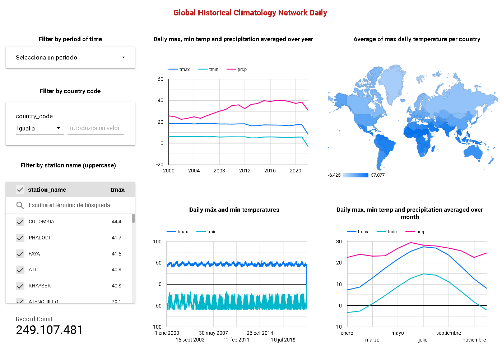

# Global Historical Climatology Network Daily Data Pipeline

- [Global Historical Climatology Network Daily Data Pipeline](#global-historical-climatology-network-daily-data-pipeline)
  - [Minimum project requirements](#minimum-project-requirements)
  - [Problem statement](#problem-statement)
  - [Main objective](#main-objective)
  - [Dataset description](#dataset-description)
  - [Proposal to address the requirements](#proposal-to-address-the-requirements)
    - [Technologies](#technologies)
    - [Solution](#solution)
  - [Results](#results)
  - [Setup and running](#setup-and-running)
    - [Setup](#setup)
    - [Run pipelines](#run-pipelines)
  - [ToDo](#todo)

## Minimum project requirements

- Select a dataset.
- Create a pipeline for processing this dataset and putting it to a datalake.
- Create a pipeline for moving the data from the lake to a data warehouse.
- Transform the data in the data warehouse: prepare it for the dashboard.
- Create a dashboard.

## Problem statement
Global historical weather data is large, collected from year 1763 until today. There are over 160K weather stations across the world, each of them generating several observations on a daily basis. This sum up a total of more than 1.75B observations.  
The data is also not ready to perform analytics tasks over the entire dataset or those requiring geolocation information.
All that information has to be processed (ELT) to enable analytics tasks using information from several years, locations, observation date and type ans so on  
As an example:  
- Max daily temperature in France (over all territory) in 1992.
- Plot a comparison of the main daily minimum temperature by year between NewYork and Miami.
- Overall ten hottest days in Madrid.
It is advisable that joins and aggregations will be needed for such kind of analysis.

## Main objective
Develop the data infrastructure including data pipeline and dashboard for users to perform advanced analytics tasks on the global historical weather data.

## Dataset description

**NOAA Global Historical Climatology Network Daily (GHCN-D)**  
[Global Historical Climatology Network - Daily](https://github.com/awslabs/open-data-docs/tree/main/docs/noaa/noaa-ghcn) is a dataset from NOAA that contains daily observations over global land areas (e.g. TMAX, SNOW...). It contains station-based observations from land-based stations worldwide. It is updated daily. The data is in CSV format. Each file corresponds to a year from 1763 to present and is named as such.  
Each file contains all weather observations from all the stations for all days in that year.  
Data description of the stations and countries, including geolocation, are available in a separate files.  

Information of all stations is stored in a specific file.
File format examples:
- http://noaa-ghcn-pds.s3.amazonaws.com/csv.gz/1788.csv.gz
- http://noaa-ghcn-pds.s3.amazonaws.com/csv.gz/1788.csv
- http://noaa-ghcn-pds.s3.amazonaws.com/ghcnd-stations.txt

Observation format:
- ID = 11 character station identification code
- YEAR/MONTH/DAY = 8 character date in YYYYMMDD format (e.g. 19860529 = May 29, 1986)
- ELEMENT = 4 character indicator of element type:
  - PRCP = Precipitation (tenths of mm)
  - SNOW = Snowfall (mm)
	- SNWD = Snow depth (mm)
  - TMAX = Maximum temperature (tenths of degrees C)
  - TMIN = Minimum temperature (tenths of degrees C)
- DATA VALUE = 5 character data value for ELEMENT 
- M-FLAG = 1 character Measurement Flag 
- Q-FLAG = 1 character Quality Flag 
- S-FLAG = 1 character Source Flag 
- OBS-TIME = 4-character time of observation in hour-minute format (i.e. 0700 =7:00 am

Format of ghcnd-stations.txt  
- Variable   Columns   Type
- ID            1-11   Character
- LATITUDE     13-20   Real
- LONGITUDE    22-30   Real
- ELEVATION    32-37   Real
- STATE        39-40   Character
- NAME         42-71   Character
- GSN FLAG     73-75   Character
- HCN/CRN FLAG 77-79   Character
- WMO ID       81-85   Character

Format of ghcnd-countries.txt  
- Variable   Columns   Type
- CODE          1-2    Character
- NAME         4-50    Character

## Proposal to address the requirements

### Technologies
- Cloud: GCP
- Infrastructure as code (IaC): Terraform
- Workflow orchestration: Airflow (ingestion pipeline)
- Data Wareshouse: BigQuery
- Data Lake: GCS
- Batch processing/Transformations: dbt (transformation pipeline)
- Stream processing: None
- Dashboard: Google Data Studio

### Solution

Note: Although it is possible to orchestrate dbt cloud job with airflow, this requires upgrade the account to use dbt API, having some cost. To avoid any cost, transformation pipeline is orchestrated as a job in dbt cloud.  

In order to save space and costs, the range of years to be processed can be configured. See [Run pipelines](#run-pipelines).
- Infraestructure as code: Use Terraform to create a bucket GCS and dataset in BQ
  - ghcdn_raw bucket to store parquet files.
  - dhcdn dataset for the ingestion into BigQuery.
  - dbt_xxxx dataset for dbt development environment.
  - production dataset for dbt production environment.  
- Orchestration: Use Airflow to orchestrate data ingestion. Use dbt job to orchestrate transformation pipeline.  
- Data ingestion: Use Airflow to get data from AWS bucket to CGS and then to BigQuery:  
  - Dag aws_gcs_other_datasets_dag to ingest stations and countries data only once.  
    - stations and countries are txt files, so need to be transformed to csv and then to parquet files.  
  - Dag aws_gcs_past_years_dag to ingest observations from last years (until 2021) on a yearly basis with catchup.  
    - This dag can be run only one, since these observations will likely not change anymore.  
  - Dag aws_gcs_current_year_dag to ingest observations from current year on a daily basis (catchup of only one day):  
    To accelerate queries and data processing, each table of year (with observations) has been partitioned by date of observation and clustered by station.  
    Original date type integer from parquet file schema is transformed to date type when generating BigQuery table in order to be able to partition by time.  
- Transformations: Use dbt to perform unions, joins and aggregations on BQ.  
  - Staging (materialized=view):  
    - Stations and countries: Create staged model from stations and countries tables in Big Query.  
    - The output will be `stg_stations` and `stg_countries` models.  
      In the stations model, extract country_code field from the station id field.  
    - Years:
      - Option 1 (discarded). Create staged model (view) for each year. 
        The number of years may be too large. There is a one to one restriction model-table in dbt. So it is pointless to have such a large number of models. 
      - Option 2: Create a fact_observations model that will loop through all BigQuery year tables, transforms them and union all together.  
        Staging models:
        Transformation for each year table:
        Observations with q_flag (quality flag) are discarded.
        Each row will have all observations for an specific day from a station. This will save space and will perform better.
        In case of several observations (by a single station) of the same type in the same day, observations are averaged.
        tmax and tmin observations are converted to degree. Max and min temperatures outside the range (-60,+60) are discarded.  
        The transformation is implemented as a macro (process_year_table).  
        The output will be a model (`stg_years_unioned`) with all years tables transformed and unioned.  
  - Core (materialized=table):
    - Create `fact_observations` materialized model by joining `stg_years_unioned` with `stg_stations` and `stg_country` models. Generated table will be partitioned by partition_date and clustered by country_code and station id.
  - Job:
    - For the convenient creation of the production dataset, a job will be created.

- Dashboard: Connect Google Data Studio to BQ dataset and design dashboard  

## Results

Other dataset ingestion pipeline (stations and countries)

Past years ingestion pipeline

  

Transformation pipeline

  

Dashboard

  

Note: Record counts depends on the selected years.

## Setup and running

Terraform and Airflow will run as containers in a VM in Google Cloud.
Dbt cloud will be used to perform data transformation pipeline

### Setup
Follow the following steps in the same order:
1. Google Cloud Platform account and project:  
  Follow the instructions in [setup_gcp.md](./setup_gcp.md)  
2. Virtual Machine in Google Cloud Compute Engine:  
  Follow the instructions in [setup_vm.md](/setup_vm.md)  
3. dbt cloud account:  
  Follow the instructions in [setup_dbt.md](./setup_dbt.md)  
  
### Run pipelines

- In the VM, go to the directory ghcn-d and edit setup.sh
  - At least, set the parameter START_YEAR
- Run `source setup.sh` to apply the configuration
- Terraform
  - `cd terraform`
  - `terraform init`
  - `terraform plan`
  - `terraform apply`
  - `yes`
- Airflow
  - `cd ..`
  - `cd airflow`
  - `docker-compose build`
  - `docker-compose up airflow-init`
  - `docker-compose up`
  - Open browser. Enter `http://localhost:8080`
  - run data_ingestion_ghcn_other_datasets
  - run data_ingestion_past_years. This may take long.
  - run data_ingestion_current_year for current year (2022)
- dbt
  - Create a job named 'dbt build' and set the following command with the specific range of years: 
  - Main menu
  - Jobs
  - New job
  - Name: dbt build
  - Environment: production
  - Commands:  `dbt run --vars "{'is_test_run': false,'start_year':2000,'end_year':2022}"`  
  Note: start_year and end_year defines the range of years to be processed. Be coherent with previous setup.  
  Note: Schedule should be daily since dataset is update daily, but you can test with no schedule - manual trigger.
  - Save
  - Run Now
  fact_observations table will be generated in the production dataset.
- Google Data Studio
  - Log in datastudio.google.com
  - Create Data Source -> BigQuery
  - Select project, dataset and table: ghcn-d -> ghcnd -> fact_observations -> Connect
  - Create Report -> Add to report

## ToDo
- Documentation in dbt
- Set up dbt locally in VM and run dbt job from airflow
- CI/CD
- Use Spark/Dataproc to perform batch processing instead of using dbt
- Use dbt with incremental mode to batch process the past years
- Simulate real-time data ingestion from stations with Apache Kafka
- Cost analysis (europe-west6)
  - BigQuery
    - Active storage $0.025 per GB per month. The first 10 GB is free each month.
    - Queries (on-demand)	$7.00 per TB. The first 1 TB per month is free.    
  - GCS
    - $0.026 per GB per month. First 5GB is free each month.
- 